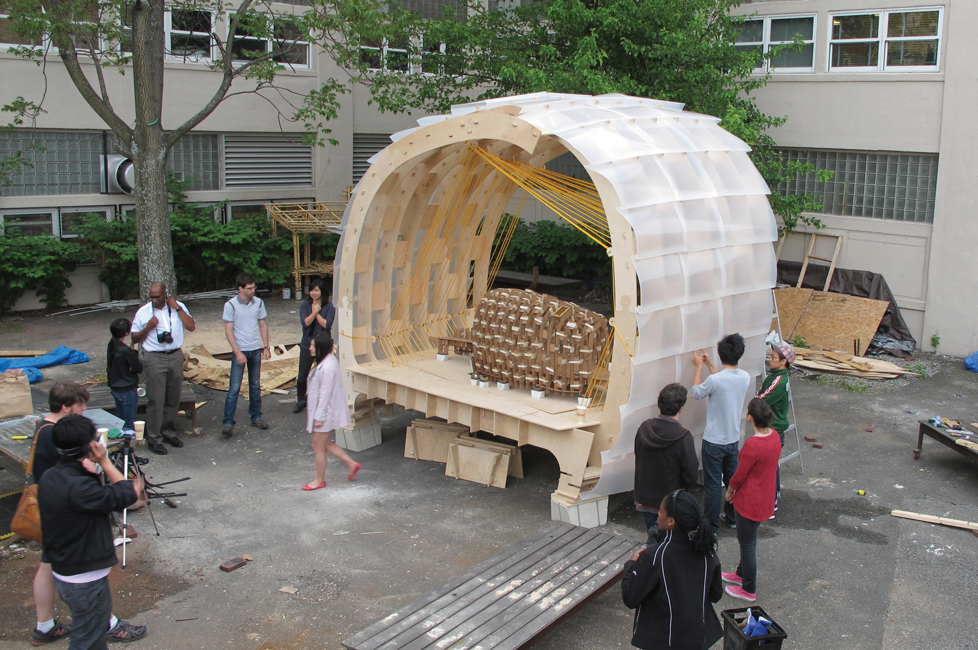
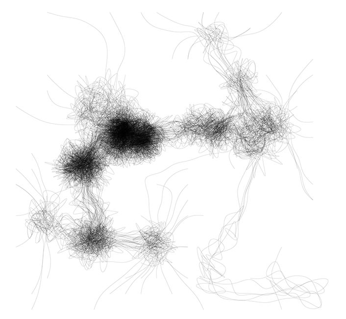

# Henry G. Skupniewicz


## stats.

* Coordinator of FabLab CEPT
* MIT Department of Architecture -- Design & Computation Group
* From Madison, Wisconsin
* When not at work, I knit, watch movies, & explore the city.
* ```HenrySkup@gmail.com``` or ```fablab@cept.ac.in```

## An 'Algorithm' is...

hahah, i'm not going to tell you!

## some cool things that I have done





