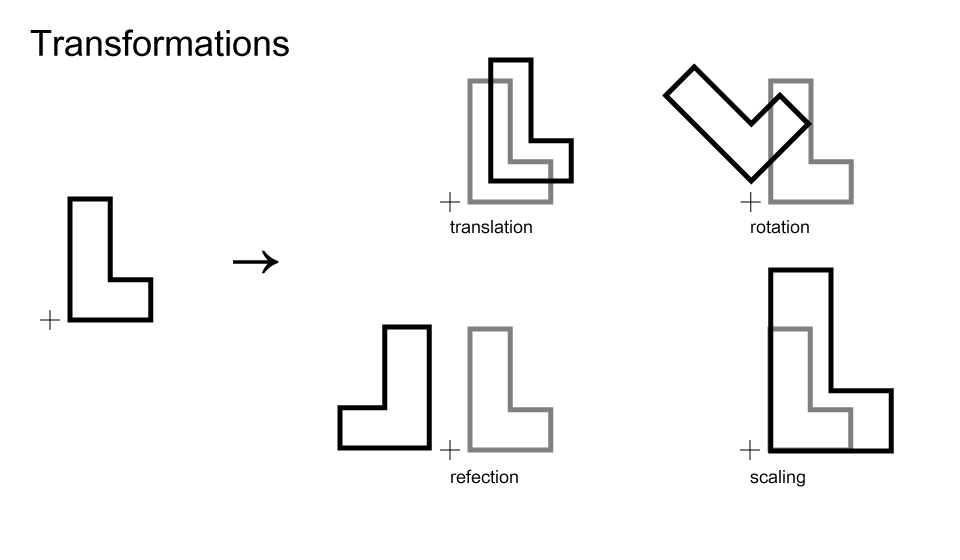
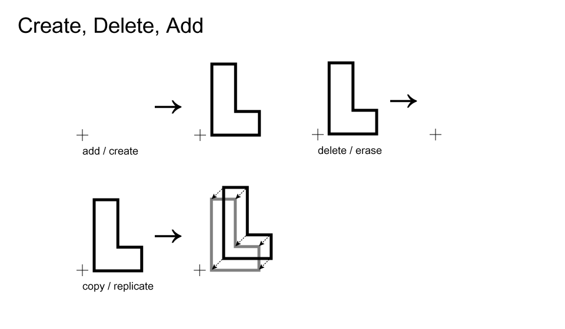

# Class 3 : Shape Grammars II

## Schedule

1. Hello
    * whatsapp group?
    * questions?
2. Student Work  
3. Trade Rules
4. "let's re-examine what we are doing here."  
5. Shape Grammars II
6. Assignment 3  

##Notes

### "let's re-examine what we are doing here."

*The ambiguity of shape* (the eye)    
`+`    
*~~Reductionism~~ Abstraction and Formal Systems* (the mind)    
`+`  
*Spacial Relationships* (the eye & the mind)    
`=`    
**Shape Grammars**

#### Formal Systems, or, What is our toolset for dealing with "shape"?

  
  

#### Spacial Relations

* ~~World Coordinate System~~
* chairs

---

### Shape Grammars II

[MIT Shape Grammar lecture about labels, et al.](http://ocw.mit.edu/courses/architecture/4-520-computational-design-i-theory-and-applications-fall-2005/lecture-notes/lect3.pdf)

* Spacial Labels ("marks")
* State Labels ("notes")

## Assignment

> Due: Next Class (14:30 IST - 26 August, 2014)

1. Worksheet
2. Author one (1) "meta-rule" which offers multiple opportunities for spacial labeling.  Explore the effects of the spacial labels.
3. Using one of the shapes produced in [2], create a "designerly" interpretation using it.  (ex. a floor-plan, section, repeating pattern, extrusion)
