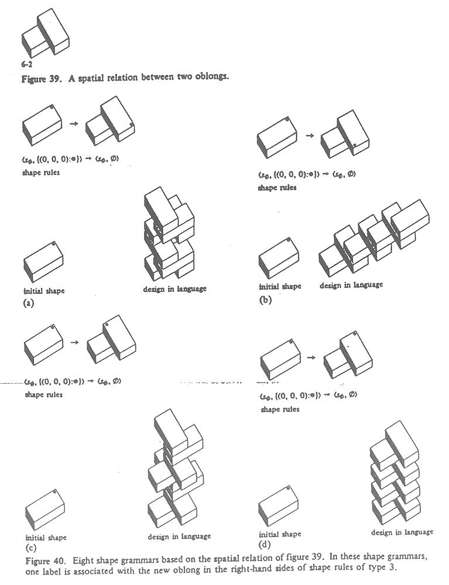
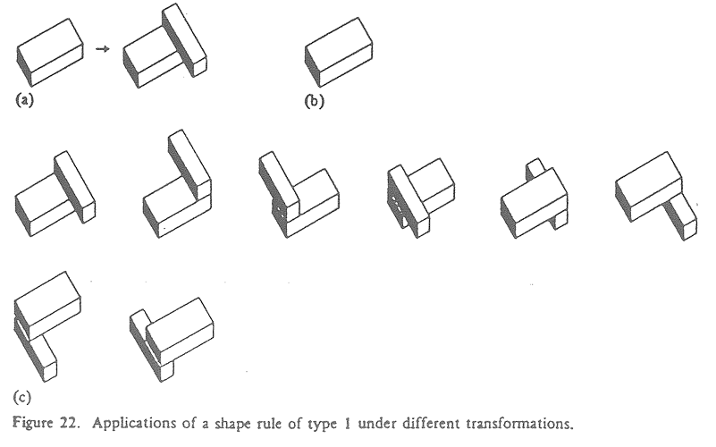

# Class 4 : Shape Grammars^3 (Shape Grammars in 3D!)

*From Stiny, "Kindergarten grammars: designing with Froebel's building gifts" Environment and Planning B Planning and Design, 1980 *

## Schedule

1. Hello
2. Student Work  
3. Worksheet (pop quiz?)
4. Shape Grammars in 3D  
5. Assignment

##Notes

### Shape Grammars in 3D

* Spacial relations in 3D & Orders of symmetry
  
*From Stiny, "Kindergarten grammars: designing with Froebel's building gifts" Environment and Planning B Planning and Design, 1980 *

## Assignment

> Due: Next Class (14:30 IST - 2 September, 2014)

Create five (5) models.  Each should be created using one (1) or two (2) shape rules, and probably should involve some sort of labeling scheme.  There shold be one (1) base shape.  Each model should have *at least* 25 base shapes.

*Some things to think about:*
1. Should shapes be able to interpenitrate?
2. If there are multiple rules, should they be applied in a patterned way? (Can labeling help you preform this function? )
